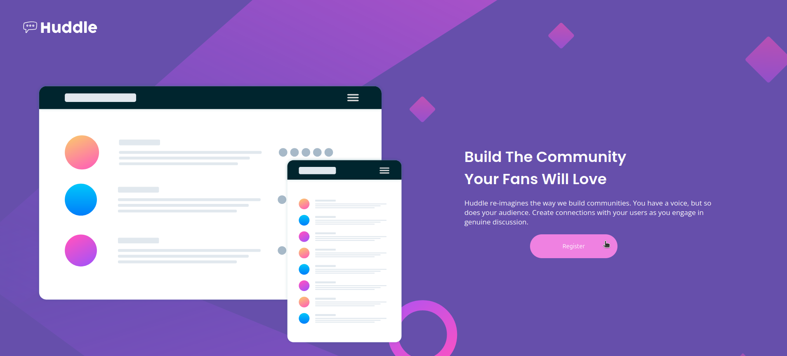

# Frontend Mentor - Huddle landing page with single introductory section solution

This is a solution to the [Huddle landing page with single introductory section challenge on Frontend Mentor](https://www.frontendmentor.io/challenges/huddle-landing-page-with-a-single-introductory-section-B_2Wvxgi0). Frontend Mentor challenges help you improve your coding skills by building realistic projects. 

## Table of contents

- [Overview](#overview)
  - [Screenshot](#screenshot)
- [My process](#my-process)
  - [Built with](#built-with)
  - [What I learned](#what-i-learned)
  - [Continued development](#continued-development)

## Overview

### Screenshot



## My process

### Built with

- Semantic HTML5 markup
- CSS custom properties
- Flexbox
- Responsive layout

### What I learned

I learned a bit more about using flex display and had less difficulty manipulating the items on the page. For the first time, I managed to make the page responsive for smaller screens and I am pleased with the result. I enjoyed working with the background image, even though I didn't manage to place certain elements exactly where I wanted them. However, I feel I came close.

```css
body {
    background-image: url("images/bg-mobile.svg");
    background-repeat: no-repeat;
    background-position: top;
    background-color: hsl(255, 37%, 49%);
    background-size: 100%;
}
```

### Continued development

I will focus more on how I can efficiently move the items on the page while maintaining responsiveness for smaller screens.
